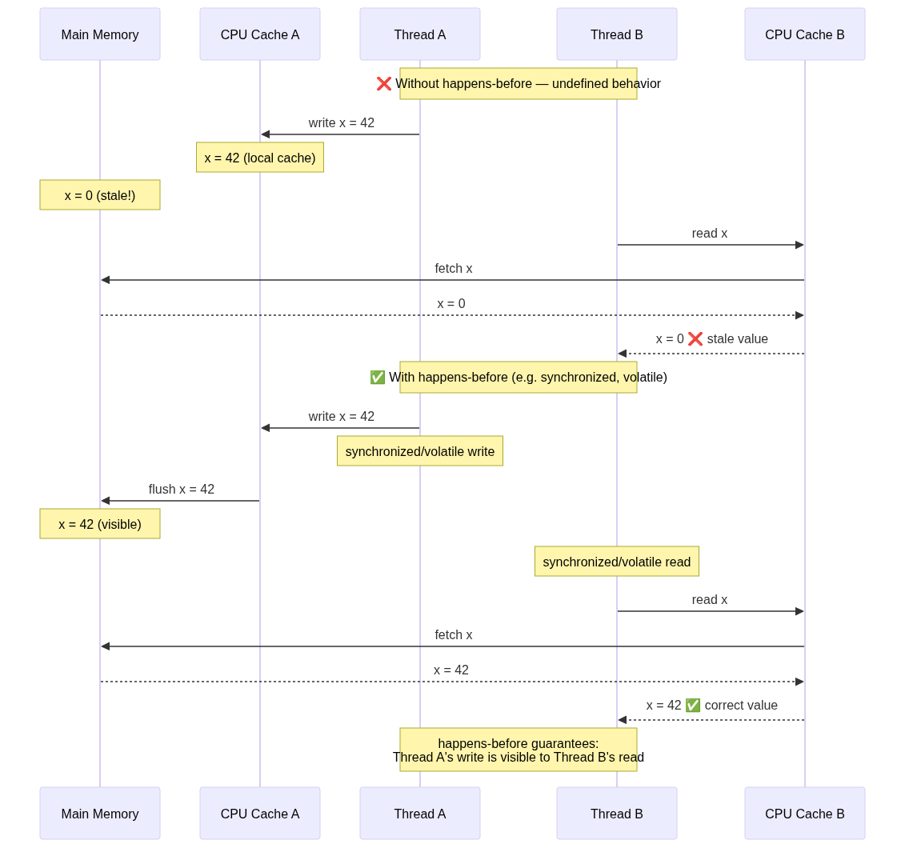
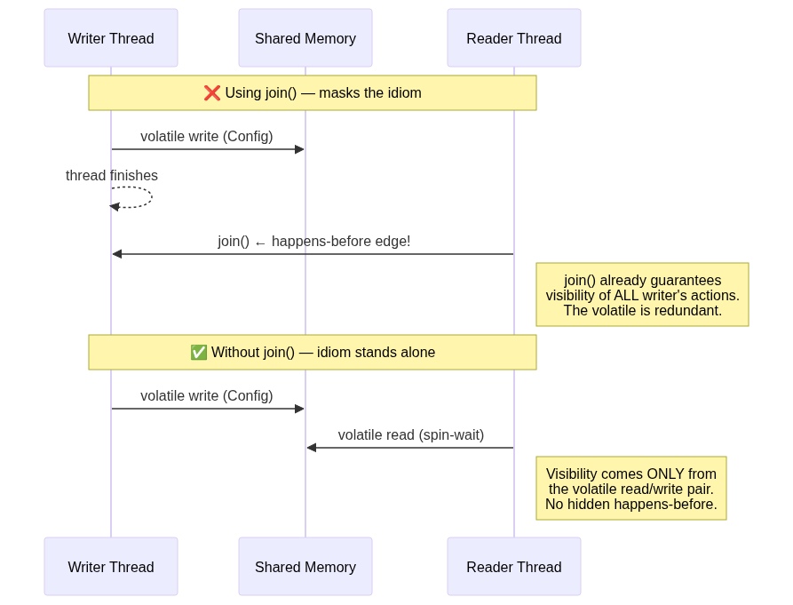
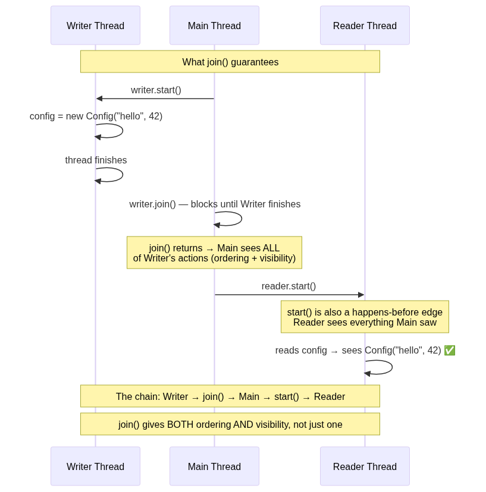
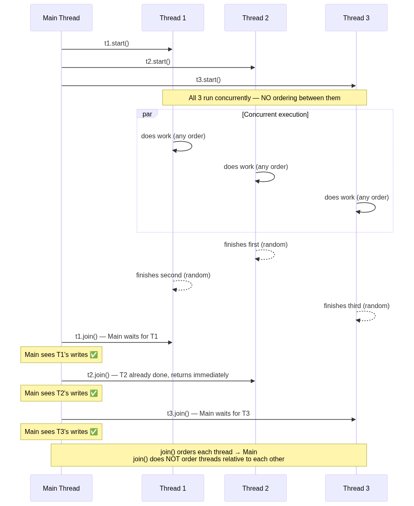

### Chapter XVI: The Java Memory Model

##### Platform Memory Model

In a shared-memory multiprocessor architecture,
each processor has its own cache that is 
periodically synchronized with the main memory.


The JMM (Java Memory Model) defines the rules for how threads interact through memory,
Defines a partial ordering called "happens-before" that guarantees visibility and ordering of memory operations across threads.
Example: If Thread A writes to a variable and then Thread B reads that variable, the JMM ensures that if Thread A's write happens-before Thread B's read, then Thread B will see the updated value.
If there is no happens-before relationship, then the behavior is undefined, and Thread B may see a stale value or even a completely different value.



#### Piggybacking on Synchronization

"Piggybacking" means exploiting an **existing** happens-before relationship to make other, unrelated writes visible — without adding extra synchronization for them.

The key insight: happens-before is **transitive**. If A happens-before B, and B happens-before C, then A happens-before C. This means that *all* writes performed by a thread before a synchronization point become visible to the thread that observes that synchronization point — not just the write to the synchronized variable itself.

**Example: `FutureTask` piggybacking**

`FutureTask` stores its result in a non-volatile field. How is the result safely published to the thread that calls `get()`? It piggybacks on the happens-before established by writing to an internal `volatile` state field:

```
Thread A (runs the task):
  1. result = computeExpensiveValue()    // write to non-volatile field
  2. state = COMPLETED                   // write to volatile field  ← synchronization point

Thread B (calls get()):
  3. read state == COMPLETED             // read volatile field      ← synchronization point
  4. return result                       // read non-volatile field
```

Step 2 happens-before step 3 (volatile write → volatile read rule).
Step 1 happens-before step 2 (program order within Thread A).
By transitivity: step 1 happens-before step 3, so step 4 sees the correct `result`.

Thread A "piggybacks" the visibility of `result` on the `volatile` write to `state`. No extra lock or volatile needed for `result` itself.

**Why it matters:**
- It's a performance optimization — avoids redundant synchronization.
- It's how many `java.util.concurrent` classes work internally (`FutureTask`, `CountDownLatch`, `Semaphore`).
- It's **fragile** — if you refactor and accidentally remove the synchronization point, the piggybacked writes silently become invisible. The code compiles, passes tests, and fails under load.

**The happens-before rules that enable piggybacking:**
1. **Program order rule** — within a single thread, each action happens-before the next action.
2. **Volatile variable rule** — a write to a `volatile` field happens-before every subsequent read of that field.
3. **Monitor lock rule** — an unlock on a monitor happens-before every subsequent lock on that same monitor.
4. **Transitivity** — if A happens-before B, and B happens-before C, then A happens-before C.

Piggybacking combines rules 1 + 4 with either rule 2 or 3: the program order rule chains all prior writes to the synchronization point, and transitivity carries that visibility across to the reading thread.

> **Rule of thumb:** Don't piggyback in application code unless you have a very good reason. Use explicit synchronization (`volatile`, `synchronized`, `Lock`) to make your intent clear. Piggybacking is a tool for library authors who need every last drop of performance and can prove correctness.

See in action: `src/main/java/dev/concurrency/memorymodel/VolatilePiggybackDemo.java`

#### Volatile = Visibility, Not Notification

A common misconception: "`volatile` makes the other thread see the value immediately." That's **half right**.

- `volatile` guarantees that **when** a thread reads the variable, it sees the **latest** value. No stale cache, no compiler optimization tricks — the real value from main memory.
- `volatile` does **not** guarantee **when** the thread will actually perform that read. It doesn't wake up threads, interrupt them, or signal them.

Think of it like a whiteboard:

```
volatile = a whiteboard that's always up to date

Thread A writes "42" on the whiteboard.

Thread B is guaranteed to see "42" the moment it LOOKS at the whiteboard.
But nobody forces Thread B to look.
If Thread B is asleep, or busy, or hasn't started yet — the whiteboard
just sits there with "42" on it, waiting.
```

This is why a `while (!ready) { }` spin loop works when both threads are running — the reader keeps looking at the whiteboard in a tight loop, so it sees the update almost instantly. But if the writer never writes, the reader spins forever.

**`volatile` = "when you look, you see the truth"**
**`volatile` ≠ "you will be notified when something changes"**

For notification (actually waking up a sleeping thread), use `wait()/notify()`, `LockSupport.park()/unpark()`, `CountDownLatch`, `Semaphore`, etc.


#### Safe publication

To safely share an object between threads, you must ensure that the thread that creates the object establishes a happens-before relationship with the thread that uses it. This can be done through:
- Initializing the object in a static initializer (class loading guarantees happens-before).
- Storing the reference to the object in a `volatile` field or an `AtomicReference`.
- Publishing the object through a thread-safe collection (e.g., `ConcurrentHashMap`).
- Using a `synchronized` block or method to ensure visibility and ordering.

📎 **Code:** [`SafePublicationDemo`](../src/main/java/dev/concurrency/memorymodel/SafePublicationDemo.java)

**Why the demo avoids `join()` between writer and reader:**



#### `join()` — ordering AND visibility

`join()` is a **full happens-before edge**. It guarantees both:

1. **Ordering** — the calling thread blocks until the target thread finishes.
2. **Visibility** — when `join()` returns, the caller sees ALL writes the target thread made.

It is not "just waiting." It is a synchronization mechanism as strong as `volatile` or `synchronized`.



```
Writer Thread          Main Thread              Reader Thread
─────────────         ─────────────            ──────────────
config = new Config()
  ↓
thread finishes
                      writer.join() returns
                      Main now sees config ✅
                        ↓ (happens-before)
                      reader.start()
                                          ──→  Reader sees config ✅
                                                (inherited from Main via start())

Happens-before chain:
  Writer's actions  ─hb→  join() returns to Main  ─hb→  start() to Reader
  (transitivity: Writer's actions happen-before Reader's actions)
```

So if you write:
```java
writer.join();       // Main waits + gets visibility of Writer's actions
reader.start();      // Reader inherits that visibility from Main
```
...the reader will see the complete object even if the field is a **plain, non-volatile field**. `join()` alone safely publishes it.

#### Why this matters for the demo

That's exactly why `SafePublicationDemo` does NOT use `join()` between writer and reader. If it did, `join()` would safely publish the object by itself, making the volatile / synchronized / ConcurrentHashMap idiom invisible — you couldn't tell which mechanism was doing the work.

#### What `join()` does NOT do — ordering between threads

`join()` creates a happens-before from a thread to **main**. It does NOT create any ordering between threads themselves.



```
Main Thread:
  t1.start()  ──→  T1 runs ─────────────────── T1 finishes
  t2.start()  ──→  T2 runs ───────── T2 finishes
  t3.start()  ──→  T3 runs ──────────────── T3 finishes
  t4.start()  ──→  T4 runs ── T4 finishes
                    ↑
                    All 4 run concurrently, in ANY order.
                    No ordering between them!

  t1.join()  ← Main waits for T1, then sees T1's writes
  t2.join()  ← Main waits for T2, then sees T2's writes
  t3.join()  ← Main waits for T3, then sees T3's writes
  t4.join()  ← Main waits for T4, then sees T4's writes
```

What `join()` creates:
```
  T1's actions  ─hb→  Main after t1.join()    ✅
  T2's actions  ─hb→  Main after t2.join()    ✅
  T3's actions  ─hb→  Main after t3.join()    ✅
```

What `join()` does NOT create:
```
  T1  ←── no relationship ──→  T2    ❌
  T1  ←── no relationship ──→  T3    ❌
  T2  ←── no relationship ──→  T3    ❌
```

The threads are free to run in any order, interleave however the scheduler decides, and finish in any order. `join()` only tells main: "wait here until this one is done, and then you can see what it did."

That's why the demo output is non-deterministic — `[guarded]` might print before `[static]`, or vice versa. The four reader threads have no ordering between each other.

Instead the demo uses:
- **Spin-wait** (for volatile) — the reader spins on the volatile field itself, so visibility comes purely from the volatile read.
- **CountDownLatch** (for map and guarded) — the latch only signals "the writer stored something." The safe publication comes from `ConcurrentHashMap` or `synchronized`, not from the latch.

The `join()` calls at the end of `main()` only keep the JVM alive until all readers finish printing — by that point, each reader has already read the object through its own idiom.

> **Hint:** A `record` with only primitive/immutable components is the easiest safe publication win — its fields are `final`, so the JVM's freeze barrier guarantees any thread that sees the reference also sees fully initialized fields. No `volatile`, no lock, no effort.

